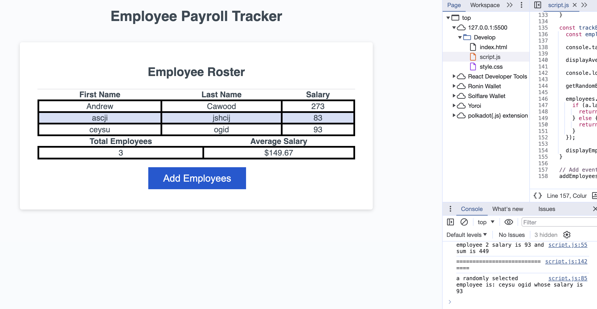

# 03 JavaScript: Employee Payroll Tracker

## Employee Payroll Trachker

This app displays a table of employees and allows the adding of employees using first name, last name and salary.

## screenshot

## Installation
install by copying files in in web server folder.

## Deployment Example
